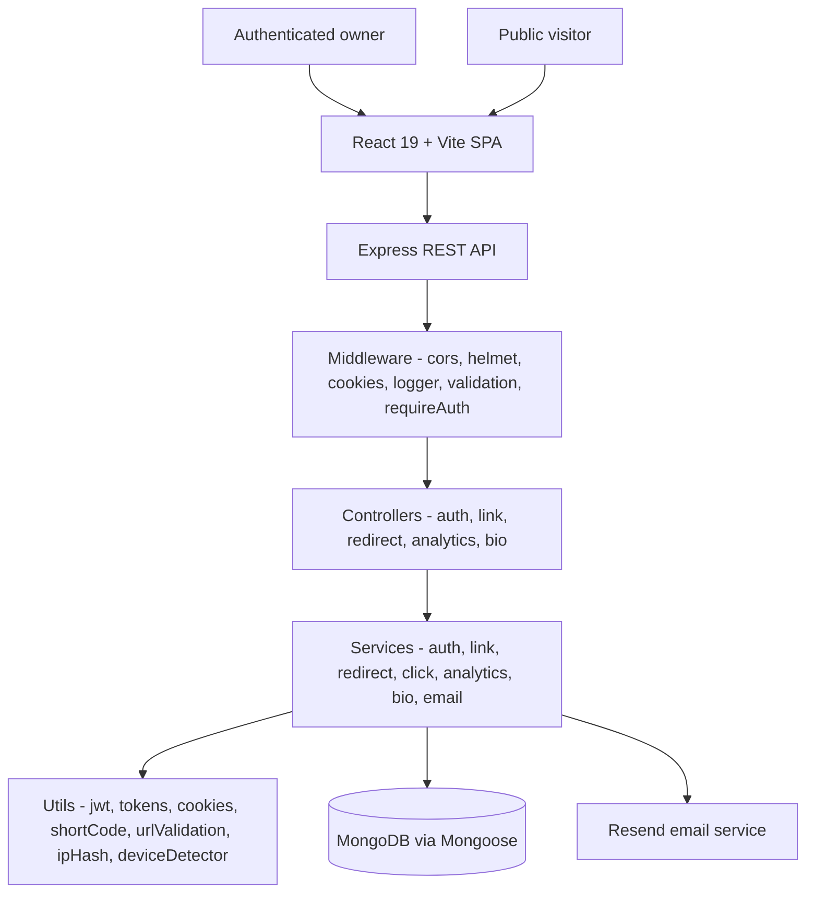
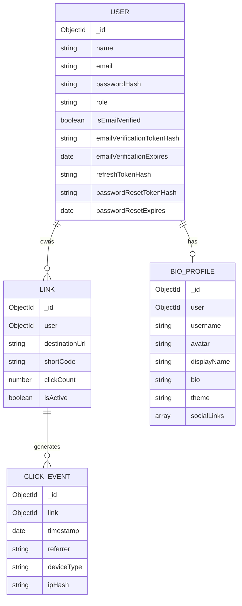
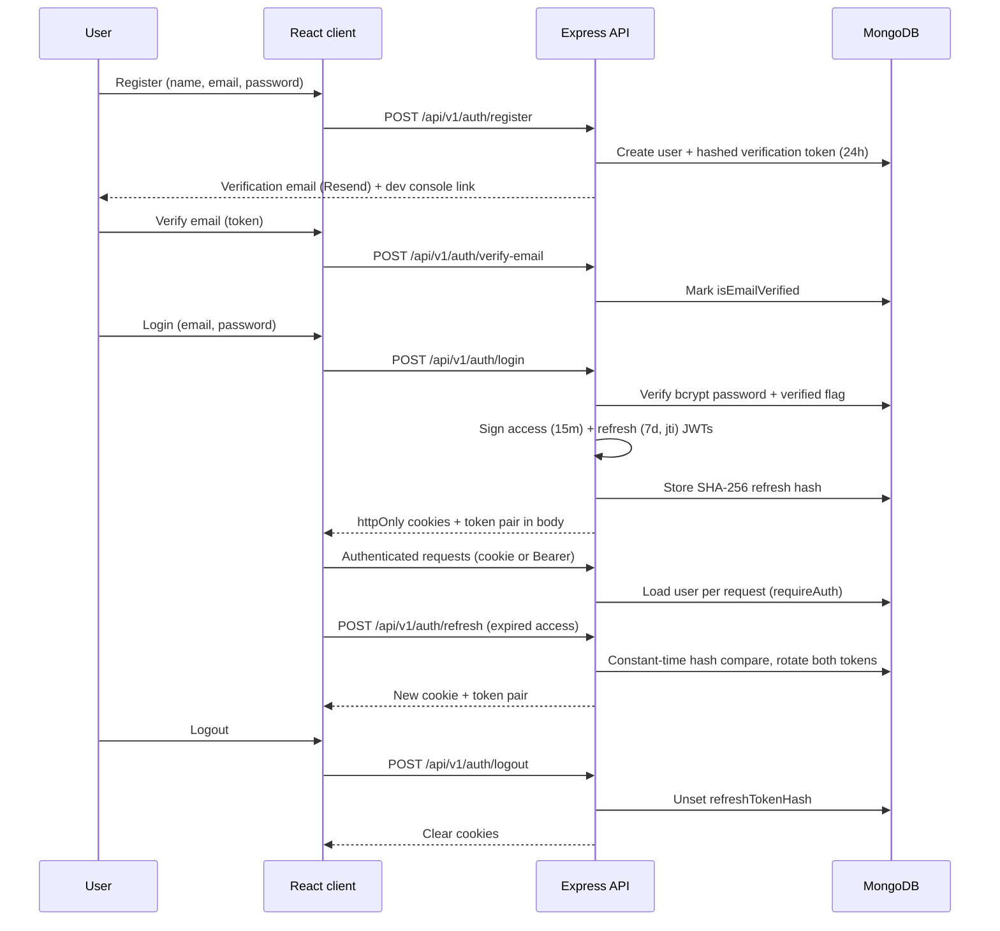
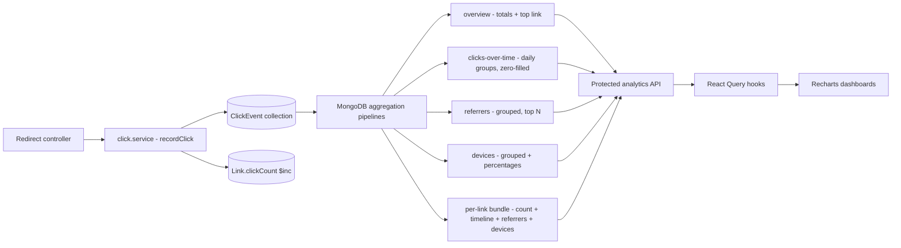
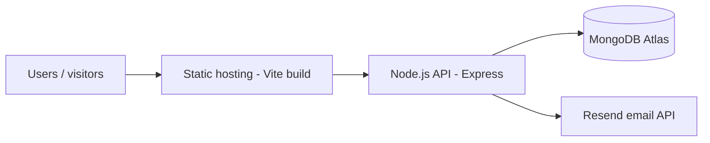

# Branded Short-Link & Bio-Link Hub

> A full-stack platform for creating branded short URLs, managing Link-in-Bio profiles, generating QR codes, and analyzing link engagement from a unified dashboard.


## Table of Contents

- [Overview](#overview)
- [Key Capabilities](#key-capabilities)
- [Product Workflow](#product-workflow)
- [Architecture](#architecture)
- [Frontend Architecture](#frontend-architecture)
- [Backend Architecture](#backend-architecture)
- [Database Architecture](#database-architecture)
- [Database Indexes](#database-indexes)
- [Authentication & Authorization](#authentication--authorization)
- [Short-Link Redirect Architecture](#short-link-redirect-architecture)
- [Analytics Architecture](#analytics-architecture)
- [QR Code Architecture](#qr-code-architecture)
- [Link-in-Bio Architecture](#link-in-bio-architecture)
- [API Reference](#api-reference)
- [Environment Configuration](#environment-configuration)
- [Installation](#installation)
- [Environment Setup](#environment-setup)
- [Running the Application](#running-the-application)
- [Testing](#testing)
- [Security](#security)
- [Production Deployment](#production-deployment)
- [Deployment Architecture](#deployment-architecture)
- [Project Structure](#project-structure)
- [Engineering Decisions](#engineering-decisions)
- [Performance Considerations](#performance-considerations)
- [Error Handling](#error-handling)
- [Development Guidelines](#development-guidelines)
- [Future Improvements](#future-improvements)
- [Known Limitations](#known-limitations)
- [Security Disclosure](#security-disclosure)
- [License](#license)

## Overview

The Branded Short-Link & Bio-Link Hub (also referred to as **LinkHub** in the codebase) combines two commonly separate products — a URL shortener and a Link-in-Bio page builder — into one authenticated platform.

It is intended for individual creators, developers, and small teams who want short, shareable links (`/r/:shortCode`), a public profile page (`/bio/:username`), QR codes for offline sharing, and per-link engagement analytics without operating multiple services.

The core workflow is:

1. A user registers, verifies their email, and logs in.
2. The user creates short links (auto-generated or custom vanity slugs) pointing at destination URLs.
3. The user optionally creates one Link-in-Bio profile with a unique username, display name, bio, avatar, theme, and up to 10 social links.
4. Visitors open short links and are redirected (HTTP 302) while a click event is recorded.
5. Visitors open public bio pages directly; no authentication is required.
6. The owner reviews aggregate and per-link analytics (clicks over time, referrers, devices) rendered with Recharts.

## Key Capabilities

### Authentication

| Capability | Status | Notes |
|---|---|---|
| Registration | Implemented | Name, email, password (min 8 chars); duplicate emails rejected with 409 |
| Email verification | Implemented | SHA-256-hashed token, 24h expiry; login blocked until verified (403) |
| Login | Implemented | bcrypt comparison; issues access + refresh JWTs |
| Access / refresh tokens | Implemented | Short-lived access token (default 15m), refresh token (default 7d) with rotation |
| Cookie + Bearer support | Implemented | `httpOnly` cookies; `Authorization: Bearer` accepted as fallback |
| Silent refresh | Implemented | Axios interceptor retries 401s via `POST /v1/auth/refresh` |
| Logout | Implemented | Revokes stored refresh-token hash, clears cookies |
| Forgot / reset password | Implemented | SHA-256-hashed reset token, 1h expiry; resets revoke refresh tokens |
| Protected routes | Implemented | `requireAuth` on links/analytics/private bio endpoints; `ProtectedRoute` in React |

### Link Management

| Capability | Status | Notes |
|---|---|---|
| Create short URLs | Implemented | `POST /api/v1/links` with `destinationUrl` + optional `customSlug` |
| Auto-generated codes | Implemented | 6-char alphanumeric codes from `crypto.randomBytes`, retried up to 10 times |
| Custom vanity slugs | Implemented | 3–20 chars, `[a-zA-Z0-9_-]`; uniqueness enforced |
| Edit links | Implemented | `PATCH /api/v1/links/:id` — destination, slug, `isActive` |
| Activate / deactivate | Implemented | `isActive: false` links resolve to 404 on redirect |
| Delete links | Implemented | Ownership-scoped `findOneAndDelete` |
| Search | Implemented | Regex search over `destinationUrl` and `shortCode`, sanitized against regex injection |
| Pagination | Implemented | `page` / `limit` (clamped to max 50), `total` + `totalPages` metadata |
| Reserved slug protection | Implemented | Slugs such as `api`, `login`, `dashboard`, `bio`, `r` are rejected |
| URL validation | Implemented | HTTP/HTTPS only; `javascript:` / `data:` / `file:` / `vbscript:` rejected |

### Analytics

| Capability | Status | Notes |
|---|---|---|
| Click tracking | Implemented | One `ClickEvent` document per redirect + atomic `clickCount` increment |
| Click counts | Implemented | Denormalized `Link.clickCount` plus event-level aggregation |
| Timeline analytics | Implemented | Daily buckets, zero-filled for days with no clicks |
| Referrer analytics | Implemented | Grouped by `referrer`; missing referrer stored as `"Direct"` |
| Device analytics | Implemented | `Mobile` / `Desktop` / `Tablet` with click counts and percentages |
| Date filtering | Implemented | `startDate` / `endDate` query params; default trailing 7 days; max 90-day range |
| Per-link analytics | Implemented | `GET /api/v1/analytics/links/:linkId` (ownership-checked) |
| Aggregate dashboard analytics | Implemented | Overview, clicks-over-time, referrers, devices endpoints |

### QR Codes

| Capability | Status | Notes |
|---|---|---|
| QR generation | Implemented | Client-side with `qrcode.react` (`QRCodeSVG`, error correction level H) |
| Short URL encoding | Implemented | QR payload is the full short URL (`{PUBLIC_BASE_URL}/r/{shortCode}`) |
| QR download | Implemented | SVG serialized to canvas and downloaded as `qr-{shortCode}.png` |
| Analytics compatibility | Implemented | QR scans open the same redirect URL, so they are recorded as clicks |

### Link-in-Bio

| Capability | Status | Notes |
|---|---|---|
| Public profile | Implemented | One profile per user; unauthenticated `GET /api/v1/bio/:username` |
| Username | Implemented | 3–30 chars, `[a-zA-Z0-9_-]`, lowercased, unique, reserved-name blocked |
| Display name / bio / avatar | Implemented | Display name required; bio max 500 chars (schema) / 300 (route validation); avatar URL string |
| Social links | Implemented | Max 10 entries; each has `platform`, `label`, `url`, `order`; HTTP/HTTPS validated |
| Link ordering | Implemented | Explicit `order` field, defaults to array index |
| Themes | Implemented | `Minimal Light`, `Dark Slate`, `Gradient` (enum-validated) |
| Public profile route | Implemented | Frontend route `/bio/:username`; backend returns only public fields |
| Bio editor + preview | Implemented | `BioEditor` page with live `BioPreview` component |

### Security

See [Security](#security) for the full list. In brief: bcrypt (12 rounds) password hashing, SHA-256 token hashes with constant-time comparison, JWT access/refresh with rotation, `httpOnly` cookies, Helmet, CORS allowlisting, production-only rate limiting, request-body validation, ownership authorization on every private resource, URL protocol allowlisting, reserved slug/username lists, search-input sanitization, SHA-256 IP hashing, and centralized error handling.

## Product Workflow

### Create Short Link

1. User authenticates (cookie or Bearer access token via `requireAuth`).
2. User submits `destinationUrl` and an optional `customSlug` from the Links page.
3. `validateBody` checks types and lengths; the link service validates the URL protocol.
4. If a custom slug is supplied, it is checked against the format regex, the reserved-slug list, and existing codes.
5. Otherwise a random 6-character code is generated and checked for collisions (up to 10 retries).
6. The link is stored in MongoDB and returned with its computed `shortUrl` (`{PUBLIC_BASE_URL}/r/{shortCode}`).
7. Public visitors open the short URL; the redirect controller issues an HTTP 302.
8. A click event is recorded asynchronously and the link's `clickCount` is incremented.

### Analytics

```text
Visitor
  → GET /r/:shortCode
    → Redirect service (lookup + active check)
      → 302 to destinationUrl
      → Click service (fire-and-forget)
        → ClickEvent document + Link.clickCount $inc
          → MongoDB aggregation (overview / timeline / referrers / devices)
            → Protected analytics API
              → React Query hooks
                → Recharts visualization (Analytics / LinkAnalytics pages)
```

Default range is the trailing 7 days; callers may pass `startDate` / `endDate` up to a 90-day window. Timeline responses are zero-filled so charts render continuous series.

### Link-in-Bio

```text
Owner → Bio Editor (/dashboard/bio) → create/update profile
  → Stored as one BioProfile per user
    → Public page /bio/:username
      → Public API returns only username, avatar, displayName, bio, theme, socialLinks
        → Visitors open social links directly
```

Usernames are lowercased at creation. The public query is case-normalized (`username.toLowerCase().trim()`), and internal fields (`user`, timestamps, `_id` exposure beyond what Mongoose returns) are excluded via field projection.

## Architecture



The diagram reflects the actual layering in `server/src`: routes delegate to controllers, controllers delegate to services, and services own all business logic and database access. `requireRole` exists as a utility but is not wired into any route; authorization is currently ownership-based (`{ _id, user }` scoping).

## Frontend Architecture

Entry point: `client/src/main.jsx` — creates the React root, configures a `QueryClient` (`retry: 1`, no refetch on window focus), and composes providers:

```text
StrictMode
└── QueryClientProvider
    └── BrowserRouter
        └── AuthProvider
            └── ToastProvider
                └── App → AppRoutes
```

### Routing (`src/routes/AppRoutes.jsx`)

Public routes under `PublicLayout`: `/`, `/login`, `/register`, `/verify-email`, `/forgot-password`, `/reset-password`, `/bio/:username`, plus a catch-all `NotFound`.

Protected routes under `ProtectedRoute` + `DashboardLayout`: `/dashboard`, `/dashboard/links`, `/dashboard/analytics`, `/dashboard/analytics/:linkId`, `/dashboard/bio`.

### Layers

| Layer | Location | Responsibility |
|---|---|---|
| Pages | `src/pages/` | `Home`, `Login`, `Register`, `VerifyEmail`, `ForgotPassword`, `ResetPassword`, `Dashboard`, `Links`, `Analytics`, `LinkAnalytics`, `BioEditor`, `PublicBio`, `NotFound` |
| Layouts | `src/layouts/` | `PublicLayout` (marketing/auth shell), `DashboardLayout` (sidebar + mobile drawer + outlet) |
| Contexts | `src/contexts/` | `AuthContext` (session, login/logout/register/verify/reset), `ToastContext` (notifications) |
| Hooks | `src/hooks/` | `useLinks`, `useAnalytics`, `useBio` (React Query queries/mutations); `use-media-query` |
| API service | `src/services/api.js` | Axios instance (`VITE_API_URL` or `/api`, `withCredentials`), sessionStorage token cache, auto-refresh interceptor |
| Components | `src/components/` | `QRCodeModal`, `BioPreview`, `common/ProtectedRoute`, `common/UIComponents`, `ui/*` (Base UI / shadcn-style primitives) |
| Lib / utils | `src/lib/`, `src/utils/` | `utils.js` (class merging), `segmented-control.js`, misc helpers |

Authentication state lives in `AuthContext`, which bootstraps via `GET /v1/auth/me` and falls back to `POST /v1/auth/refresh`. Data fetching uses TanStack React Query with cache invalidation on mutations (e.g., link creation invalidates the `["links"]` key). Charts are rendered with Recharts; icons come from `lucide-react`.

```text
client/
├── src/
│   ├── App.jsx
│   ├── main.jsx
│   ├── index.css
│   ├── components/
│   │   ├── BioPreview.jsx
│   │   ├── QRCodeModal.jsx
│   │   ├── common/
│   │   └── ui/                  # Base UI / shadcn-style primitives
│   ├── contexts/                # AuthContext, ToastContext
│   ├── hooks/                   # useLinks, useAnalytics, useBio
│   ├── layouts/                 # DashboardLayout, PublicLayout
│   ├── lib/                     # utils, segmented-control
│   ├── pages/                   # 13 pages (see table above)
│   ├── routes/AppRoutes.jsx
│   ├── services/api.js
│   ├── assets/
│   └── utils/
├── package.json
├── vite.config.js               # @ alias, dev proxy for /api and /r
└── vercel.json                  # SPA rewrites to index.html
```

## Backend Architecture

```text
server/
├── src/
│   ├── app.js                   # Express app: helmet, cors, parsers, loggers, rate limits, route mounts
│   ├── server.js                # DB connect + listen
│   ├── config/                  # env.js, db.js, testEnv.js
│   ├── controllers/             # auth, link, redirect, analytics, bio controllers
│   ├── middleware/              # asyncHandler, errorHandler, notFound, requestLogger, requireAuth, requireRole, validate
│   ├── models/                  # User, Link, ClickEvent, BioProfile
│   ├── routes/                  # auth, link, analytics, bio, redirect, health
│   ├── services/                # auth, link, redirect, click, analytics, bio, email
│   ├── utils/                   # AppError, jwt, token, cookie, shortCode, shortUrl, urlValidation,
│   │                            # validation, reservedSlugs, constants, ipHash, deviceDetector,
│   │                            # logger, seed, test helpers
│   └── __tests__/              # 9 suites (see Testing)
├── package.json
└── run-tests.sh
```

| Layer | Responsibility |
|---|---|
| Routes | URL mapping, `validateBody` schemas, `requireAuth` gating, MongoId format check for link IDs |
| Controllers | Thin adapters: extract `req` data, call services, shape `{ success, message, data }` responses |
| Services | Business rules: slug/username validation, uniqueness, hashing, aggregation, email dispatch |
| Models | Mongoose schemas, field validation, unique constraints, indexes |
| Middleware | Async error capture, auth, validation, 404 + centralized error translation, request logging |
| Utils | Token/JWT/cookie helpers, short-code generation, URL checks, IP hashing, device detection |
| Config | Environment parsing with production-required-variable enforcement; Mongoose connection |

## Database Architecture



### User

Purpose: identity, credentials, and token state. `email` is unique, lowercased, and regex-validated. `passwordHash` and all token hashes/ expiries are `select: false` so they never leak through default queries. `role` is `user` or `admin` (default `user`). Timestamps enabled.

### Link

Purpose: a short code mapped to a destination. `user` references the owner; `destinationUrl` requires HTTP/HTTPS at both schema and service level; `shortCode` is unique, 3–20 chars, `[a-zA-Z0-9_-]`; `clickCount` is a denormalized counter maintained via `$inc`; `isActive` gates redirects. Timestamps enabled.

### ClickEvent

Purpose: immutable analytics fact table, one document per redirect. `link` references the link; `timestamp` defaults to now; `referrer` defaults to `null` at the schema level (`"Direct"` is applied by the service layer); `deviceType` is enum-constrained to `Mobile | Desktop | Tablet`; `ipHash` stores a SHA-256 digest, never the raw IP. No `createdAt`/`updatedAt` (timestamps disabled) to keep event writes lean.

### BioProfile

Purpose: one public page per user. `user` is unique (one profile per account); `username` is unique, 3–30 chars; `displayName` required (max 100); `bio` defaults to `""` (max 500); `theme` enum (`Minimal Light`, `Dark Slate`, `Gradient`); `socialLinks` is an embedded subdocument array (max 10) with `platform`, `label`, `url`, `order`. Timestamps enabled.

## Database Indexes

| Collection | Index | Purpose |
|---|---|---|
| `users` | Unique on `email` (schema `unique: true`) | Fast login lookup; duplicate prevention |
| `links` | Unique on `shortCode` (schema `unique: true`) | O(1) redirect resolution; slug uniqueness |
| `links` | `{ user: 1 }` (field-level `index: true`) | Owner-scoped link listing |
| `links` | `{ user: 1, createdAt: -1 }` | Sorted, paginated dashboard queries |
| `clickevents` | `{ link: 1 }` (field-level `index: true`) | Per-link analytics |
| `clickevents` | `{ link: 1, timestamp: -1 }` | Time-range per-link aggregation |
| `clickevents` | `{ timestamp: -1 }` | Cross-link time-range scans |
| `bioprofiles` | Unique on `user` (schema `unique: true`) | Enforce one profile per account |
| `bioprofiles` | Unique on `username` (schema `unique: true`) | Fast public-profile lookup; name uniqueness |

## Authentication & Authorization



Key behaviors, all verified in `auth.service.js`, `jwt.js`, `token.js`, `cookie.js`, and `requireAuth.js`:

- Passwords hashed with bcrypt (12 rounds); never stored or returned in plaintext.
- Email verification and password-reset tokens are 32 random bytes, stored as SHA-256 hashes, compared with `crypto.timingSafeEqual`.
- Verification links expire after 24h; reset links after 1h. Reset also revokes the stored refresh token, forcing re-login on all sessions.
- Login is refused for unverified emails (403) with a generic invalid-credentials message (401) for wrong email/password to avoid account enumeration.
- Refresh rotates **both** tokens (new `jti` each time); reuse of a revoked refresh token clears the session.
- `requireAuth` accepts the `access_token` cookie or a `Bearer` header, verifies type is `access`, and loads the user from MongoDB on each request.
- All link/analytics/private-bio queries are scoped to `req.user.id`; cross-user access returns 404, not 403, to avoid ID probing.
- `requireRole` middleware and the `role` field exist, but no route currently enforces roles — authorization today is ownership-based.

## Short-Link Redirect Architecture

Route: `GET /r/:shortCode` (`server/src/controllers/redirect.controller.js`, `services/redirect.service.js`, `services/click.service.js`).

1. `resolveShortLink` looks up `Link.findOne({ shortCode })`.
2. Unknown codes → 404 `Short link not found`.
3. `isActive: false` → 404 `This short link has been disabled` (indistinguishable from unknown, by design).
4. On success the controller immediately issues `res.redirect(302, destinationUrl)` — the visitor never waits for analytics.
5. After the redirect, `recordClick` runs fire-and-forget: creates a `ClickEvent` (`referrer` defaults to `"Direct"`, device from User-Agent regex, IP as SHA-256 hash) and atomically increments `Link.clickCount` via `$inc`.
6. Telemetry failures are caught and logged without affecting the redirect, so a database hiccup degrades analytics, not navigation.

## Analytics Architecture



Implementation notes (`services/analytics.service.js`):

- Every query first resolves the caller's link IDs, so users only ever aggregate their own data.
- Date handling: `startDate`/`endDate` are normalized to UTC day boundaries; the default window is the trailing 7 days; ranges over 90 days are rejected with 400.
- `overview` returns `{ totalClicks, totalLinks, activeLinks, topLink }` via parallel count + aggregation queries (with a zero-click fast path).
- `clicks-over-time` groups by `%Y-%m-%d` and then zero-fills missing days in application code.
- `referrers` caps `limit` at 50; per-link analytics caps at 10.
- Device breakdowns always return all three device types with `clicks` and rounded `percentage`, even when zero.

## QR Code Architecture

QR codes are generated entirely client-side — there is no server QR endpoint:

- Library: `qrcode.react` (`QRCodeSVG`), rendered at size 180 with error-correction level `H` and margin.
- Payload: the link's full `shortUrl` (e.g., `{PUBLIC_BASE_URL}/r/{shortCode}`), displayed beneath the code in monospace.
- Download: `QRCodeModal` serializes the SVG, draws it onto a white-backed canvas, and triggers a `qr-{shortCode}.png` download — no network round-trip.
- Analytics: scanning a QR code performs a normal `GET /r/:shortCode`, so scans appear in click timelines, referrer stats (typically `Direct`), and device stats like any other visit.

## Link-in-Bio Architecture

- Creation: `POST /api/v1/bio` (authenticated). Rejected with 409 if the user already has a profile; usernames are lowercased, format-checked, reserved-name-checked, and uniqueness-checked.
- Update: `PATCH /api/v1/bio` (authenticated). Each field is validated independently; username changes re-check reservations and collisions.
- Deletion: `DELETE /api/v1/bio` (authenticated).
- Private read: `GET /api/v1/bio/me` returns the full document or `null` when absent (HTTP 200 either way, so the editor can distinguish "no profile yet").
- Public read: `GET /api/v1/bio/:username` requires no auth, normalizes case/whitespace, projects only `username avatar displayName bio theme socialLinks`, and returns 404 for unknown names.
- Reserved usernames include `api`, `login`, `register`, `dashboard`, `admin`, `auth`, `r`, `bio`, `assets`, `forgot-password`, `reset-password`, `verify-email`, and similar route-collision names.
- Frontend: `BioEditor` (dashboard) pairs a form with the live `BioPreview` component; `PublicBio` renders `/bio/:username` with theme-specific styling for the three supported themes.

## API Reference

Base path: `/api`. Authenticated endpoints accept the `access_token` cookie or `Authorization: Bearer <token>`.

### Authentication

| Method | Endpoint | Auth | Purpose |
|---|---|---|---|
| POST | `/api/v1/auth/register` | No | Register; body `{ name, email, password }` → 201 + user |
| POST | `/api/v1/auth/verify-email` | No | Verify email; body `{ token }` |
| POST | `/api/v1/auth/login` | No | Login; sets cookies, returns `{ user, accessToken, refreshToken }` |
| POST | `/api/v1/auth/refresh` | Refresh token (cookie or `{ refreshToken }`) | Rotate session tokens |
| POST | `/api/v1/auth/logout` | Yes | Revoke refresh token, clear cookies |
| GET | `/api/v1/auth/me` | Yes | Current user |
| POST | `/api/v1/auth/forgot-password` | No | Request reset; always returns generic message |
| POST | `/api/v1/auth/reset-password` | No | Reset with `{ token, password }` |

### Links

| Method | Endpoint | Auth | Purpose |
|---|---|---|---|
| POST | `/api/v1/links` | Yes | Create; body `{ destinationUrl, customSlug? }` → 201 + link with `shortUrl` |
| GET | `/api/v1/links?page=&limit=&search=&isActive=` | Yes | Paginated, searchable, filterable list |
| GET | `/api/v1/links/:id` | Yes | Single link (owner-scoped, MongoId-validated) |
| PATCH | `/api/v1/links/:id` | Yes | Update `{ destinationUrl?, customSlug?, isActive? }` |
| DELETE | `/api/v1/links/:id` | Yes | Delete (owner-scoped) |

```bash
curl -X POST http://localhost:5000/api/v1/links \
  -H "Content-Type: application/json" \
  -H "Authorization: Bearer <access-token>" \
  -d '{ "destinationUrl": "https://example.com/article", "customSlug": "launch-2026" }'
```

### Redirects

| Method | Endpoint | Auth | Purpose |
|---|---|---|---|
| GET | `/r/:shortCode` | No | 302 redirect to destination; records click event |

### Analytics

| Method | Endpoint | Auth | Purpose |
|---|---|---|---|
| GET | `/api/v1/analytics/overview?startDate=&endDate=` | Yes | `{ totalClicks, totalLinks, activeLinks, topLink }` |
| GET | `/api/v1/analytics/clicks-over-time?startDate=&endDate=` | Yes | Zero-filled `[{ date, clicks }]` series |
| GET | `/api/v1/analytics/referrers?startDate=&endDate=&limit=` | Yes | `[{ referrer, clicks }]` ranked |
| GET | `/api/v1/analytics/devices?startDate=&endDate=` | Yes | `[{ deviceType, clicks, percentage }]` for all three types |
| GET | `/api/v1/analytics/links/:linkId?startDate=&endDate=` | Yes | Per-link bundle (owner-checked) |

### Bio Profiles

| Method | Endpoint | Auth | Purpose |
|---|---|---|---|
| GET | `/api/v1/bio/me` | Yes | Owner's full profile, or `data: null` |
| POST | `/api/v1/bio` | Yes | Create; `{ username, displayName, bio?, avatar?, theme?, socialLinks? }` → 201 |
| PATCH | `/api/v1/bio` | Yes | Partial update of the owner's profile |
| DELETE | `/api/v1/bio` | Yes | Delete the owner's profile |
| GET | `/api/v1/bio/:username` | No | Public profile (projected fields only) |

### Health

| Method | Endpoint | Auth | Purpose |
|---|---|---|---|
| GET | `/api/health` | No | `{ success: true, message: "API is running", timestamp }` |

## Environment Configuration

| Variable | Required | Purpose | Example |
|---|---|---|---|
| `NODE_ENV` | No | `development` / `production` / `test`; gates rate limiting, cookie flags, dev token logging | `development` |
| `PORT` | No | Backend listen port (default 5000) | `5000` |
| `MONGODB_URI` | Yes | MongoDB connection string (required in all envs; enforced at boot) | `mongodb://localhost:27017/short_link_bio_hub` |
| `CLIENT_URL` | No | Frontend origin for CORS + email links (default `http://localhost:5173`) | `http://localhost:5173` |
| `PUBLIC_BASE_URL` | No | Public backend origin used to build short URLs (default `http://localhost:5000`) | `http://localhost:5000` |
| `JWT_ACCESS_SECRET` | Yes (prod) | HMAC secret for access tokens | 64-byte random hex |
| `JWT_REFRESH_SECRET` | Yes (prod) | HMAC secret for refresh tokens (must differ from access secret) | 64-byte random hex |
| `ACCESS_TOKEN_EXPIRES_IN` | No | Access token TTL (default `15m`) | `15m` |
| `REFRESH_TOKEN_EXPIRES_IN` | No | Refresh token TTL (default `7d`) | `7d` |
| `COOKIE_SECURE` | No | Documented convention for cookie setup (runtime derives from `NODE_ENV`) | `false` |
| `COOKIE_SAME_SITE` | No | Documented convention for cookie setup (runtime derives from `NODE_ENV`) | `lax` |
| `VITE_API_URL` | No | Frontend build-time backend URL; unset means same-origin `/api` | `https://your-backend.onrender.com/api` |
| `RESEND_API_KEY` | No | Enables real verification/reset emails via Resend; sends are skipped with a warning when unset | — |
| `EMAIL_FROM` | No | Sender identity (default `LinkHub <onboarding@resend.dev>`) | `LinkHub <hello@example.com>` |

Generate secrets with:

```bash
node -e "console.log(require('crypto').randomBytes(64).toString('hex'))"
```

## Installation

Prerequisites:

- Node.js 18+ and npm
- MongoDB (local instance or MongoDB Atlas)
- Git

```bash
git clone https://github.com/Patelprince6064/LinkFlow.git
cd LinkFlow
npm run install:all
```

`install:all` installs root (concurrently), `client/`, and `server/` dependencies. `render.yaml` and `client/vercel.json` provide deployment defaults (see [Production Deployment](#production-deployment)).

## Environment Setup

The server loads configuration from the **repository-root** `.env` (`server/src/config/env.js` resolves `../../../.env`):

```bash
cp .env.example .env
```

Then set at minimum:

- `MONGODB_URI` — local (`mongodb://localhost:27017/short_link_bio_hub`) or Atlas SRV string.
- `JWT_ACCESS_SECRET` and `JWT_REFRESH_SECRET` — two distinct random strings (mandatory in production; the server throws at boot if missing).
- `CLIENT_URL` and `PUBLIC_BASE_URL` — must match the actual frontend origin and the public backend URL, otherwise CORS and generated short links break.
- `RESEND_API_KEY` / `EMAIL_FROM` — optional; without a key, emails are skipped and verification/reset tokens are printed to the server console in non-production environments.

## Running the Application

Scripts are defined in the root, `client/`, and `server/` `package.json` files.

### Development (both)

```bash
npm run dev
```

Runs backend (`server`, nodemon on port 5000) and frontend (`client`, Vite on port 5173) concurrently. Vite proxies `/api` and `/r` to `http://localhost:5000`, so no CORS configuration is needed locally.

### Frontend only

```bash
npm run client        # from root, or
npm run dev           # inside client/
```

### Backend only

```bash
npm run server        # from root, or
npm run dev           # inside server/
npm start --prefix server   # production entrypoint: node src/server.js
```

### Production build (frontend)

```bash
npm run build         # root → client build, or npm run build inside client/
```

Emits `client/dist/` (served per `vercel.json` with SPA rewrites).

### Seed development data

```bash
npm run seed --prefix server
```

Clears users/links/bio profiles and creates a clearly labeled dev user, link, and bio profile. Development only — never run against production data.

## Testing

The backend ships nine suites. Five run without a database; four are integration suites requiring a live MongoDB.

| Command | Suites | Requires MongoDB |
|---|---|---|
| `npm test --prefix server` | `security`, `analytics`, `bio`, `redirect`, `validation` | No |
| `npm run test:security --prefix server` | Module exports and validation checks | No |
| `npm run test:analytics --prefix server` | Analytics service exports | No |
| `npm run test:bio --prefix server` | Bio service exports | No |
| `npm run test:redirect --prefix server` | Device detection, IP hashing, short-code rules | No |
| `npm run test:validation --prefix server` | Comprehensive input-validation cases | No |
| `npm run test:auth --prefix server` | Registration, login, refresh, reset flows | Yes |
| `npm run test:links --prefix server` | Link CRUD, slugs, search, pagination | Yes |
| `npm run test:bio-full --prefix server` | Bio lifecycle incl. public resolution | Yes |
| `npm run test:analytics-db --prefix server` | Aggregation against seeded clicks | Yes |
| `npm run test:integration --prefix server` | All four DB suites sequentially | Yes |
| `npm run test:all --prefix server` | Unit + integration suites | Yes (for second half) |

A `server/run-tests.sh` runner executes the unit suites always and the integration suites only when `mongosh`/`mongo` is detected. There are no automated frontend tests; frontend verification is manual.

```bash
npm test --prefix server
npm run test:integration --prefix server   # needs MongoDB running
```

## Security

Implemented protections (each traceable to source):

- **Password hashing** — bcrypt with 12 salt rounds (`utils/token.js`); hashes are `select: false`.
- **Token storage** — email-verification, password-reset, and refresh tokens persisted as SHA-256 hashes; compared with `crypto.timingSafeEqual`.
- **JWT discipline** — separate access/refresh secrets, `type` claim enforcement, refresh rotation with fresh `jti`, revocation on logout and password reset.
- **Cookies** — `httpOnly`, `path: /`, `secure` + `sameSite: none` in production, `lax` otherwise; Bearer-header fallback for non-browser clients.
- **Email-verification gate** — unverified accounts cannot log in.
- **HTTP hardening** — Helmet defaults; JSON/urlencoded bodies capped at 1mb; `trust proxy` set only in production.
- **CORS** — single allowed origin (`CLIENT_URL`) with credentials; explicit method/header allowlists.
- **Rate limiting** — production-only: 100 req/15m per IP on `/api`, 20 req/15m on auth endpoints, 60 req/min on `/r`, 30 req/5m on `/api/v1/bio`. Development is unthrottled.
- **Validation** — `validateBody` middleware on all mutating auth/link/bio routes; Mongoose schema validators; MongoId format guard on link IDs.
- **Ownership authorization** — every private resource query includes the authenticated user ID; foreign IDs yield 404.
- **URL safety** — HTTP/HTTPS allowlist enforced in service + schema; dangerous protocols rejected.
- **Namespace protection** — reserved short-code and username lists prevent route collisions (`/api`, `/r`, `/bio`, `/login`, …).
- **Injection resistance** — search input escaped before `RegExp` construction; pagination clamped.
- **Privacy** — raw IPs never stored (SHA-256 only); token hashes and password hashes excluded from default projections; public bio endpoint projects a safe field subset.
- **Error hygiene** — operational vs. programming errors separated; duplicate-key, cast, and Mongoose validation errors mapped to safe messages; stack traces only logged server-side outside production responses.

Recommended future hardening (not currently implemented):-role-based route enforcement using the existing `requireRole` middleware, rotating `trust-proxy`/cookie settings for multi-proxy topologies, structured logging for DB/telemetry paths that still use `console`, CSRF considerations if cookie auth is used from non-SPA clients, and link-destination allow/block lists for abuse control.

## Production Deployment

The repository ships deployment defaults: `render.yaml` (backend service, `rootDir: server`, `node src/server.js`, secret generation for JWT keys) and `client/vercel.json` (Vite build, `dist` output, SPA rewrites). MongoDB is expected from Atlas or another managed instance.

Production checklist:

- [ ] Set `NODE_ENV=production` (enables rate limiting, `trust proxy`, secure cookies, disables dev token logging).
- [ ] Provide `MONGODB_URI`, `JWT_ACCESS_SECRET`, `JWT_REFRESH_SECRET` (boot fails without them).
- [ ] Set `CLIENT_URL` to the exact frontend origin (CORS + email links) and `PUBLIC_BASE_URL` to the public API origin (short-URL generation).
- [ ] If frontend and API are cross-origin, serve with HTTPS and keep `secure` cookies + `SameSite=None` (the code derives these from `NODE_ENV=production`).
- [ ] Set `VITE_API_URL=https://<api-host>/api` at frontend build time when the API is not same-origin; otherwise the `/api` relative path plus proxy config applies only to local dev.
- [ ] Configure `RESEND_API_KEY` and `EMAIL_FROM` so verification/reset emails actually deliver (otherwise users cannot verify in production, since console token logging is disabled).
- [ ] Allowlist the API host in the MongoDB Atlas network rules; use a least-privilege database user.
- [ ] Build the client (`npm run build`) and deploy `client/dist`; run the API with `npm start --prefix server` (or the Render start command) under a process manager with log collection.
- [ ] Never run `npm run seed --prefix server` against production — it wipes collections.

## Deployment Architecture



Hosting providers are examples, not commitments: the checked-in configs target Render (API) and Vercel (frontend), with Atlas as the expected database. Any static host + Node host + MongoDB combination works if the environment variables above are set consistently.

## Project Structure

```text
.
├── client/
│   ├── src/
│   │   ├── App.jsx
│   │   ├── main.jsx
│   │   ├── index.css
│   │   ├── assets/
│   │   ├── components/
│   │   │   ├── BioPreview.jsx
│   │   │   ├── QRCodeModal.jsx
│   │   │   ├── common/        # ProtectedRoute, shared UI helpers
│   │   │   └── ui/            # Base UI / shadcn-style primitives
│   │   ├── contexts/          # AuthContext, ToastContext
│   │   ├── hooks/             # useLinks, useAnalytics, useBio, use-media-query
│   │   ├── layouts/           # DashboardLayout, PublicLayout
│   │   ├── lib/               # utils, segmented-control
│   │   ├── pages/             # Home, Login, Register, VerifyEmail, ForgotPassword,
│   │   │                      # ResetPassword, Dashboard, Links, Analytics,
│   │   │                      # LinkAnalytics, BioEditor, PublicBio, NotFound
│   │   ├── routes/AppRoutes.jsx
│   │   ├── services/api.js
│   │   └── utils/
│   ├── package.json
│   ├── vite.config.js
│   └── vercel.json
├── server/
│   ├── src/
│   │   ├── app.js
│   │   ├── server.js
│   │   ├── config/            # env, db, testEnv
│   │   ├── controllers/       # auth, link, redirect, analytics, bio
│   │   ├── middleware/        # asyncHandler, errorHandler, notFound, requestLogger,
│   │   │                      # requireAuth, requireRole, validate
│   │   ├── models/            # User, Link, ClickEvent, BioProfile
│   │   ├── routes/            # auth, link, analytics, bio, redirect, health
│   │   ├── services/          # auth, link, redirect, click, analytics, bio, email
│   │   ├── utils/             # AppError, jwt, token, cookie, shortCode, shortUrl,
│   │   │                      # urlValidation, validation, reservedSlugs, constants,
│   │   │                      # ipHash, deviceDetector, logger, seed
│   │   └── __tests__/        # 9 suites + helpers
│   ├── package.json
│   └── run-tests.sh
├── docs/                      # Design notes, audits, demo script, test report
├── screenshots/
├── .env.example
├── render.yaml
├── package.json               # dev / client / server / install:all / lint / build
└── README.md
```

## Engineering Decisions

- **React + Vite + React Router** — client-rendered SPA with file-colocated pages and nested public/protected layouts; Vite dev proxy removes CORS friction for `/api` and `/r` during development.
- **Express controller/service split** — routes declare validation and auth; controllers stay thin; services own rules and persistence, which keeps the nine test suites able to target services directly.
- **MongoDB + Mongoose** — flexible social-link subdocuments and append-heavy click events fit a document model; schema validators still enforce shape at the boundary.
- **JWT in httpOnly cookies with Bearer fallback** — cookies protect the browser dashboard; Bearer support keeps the API usable from scripts; sessionStorage mirrors tokens only for the Authorization header path.
- **Click events stored separately from counters** — `ClickEvent` documents preserve referrer/device/time dimensions for aggregation, while `Link.clickCount` gives cheap dashboard totals without scanning events.
- **Aggregation over precomputation** — overview/timeline/referrer/device queries run MongoDB pipelines scoped to the caller's link IDs; correct for current scale and avoids a rollup pipeline.
- **Client-side QR generation** — `qrcode.react` needs no server state, adds no API surface, and QR scans flow through the standard redirect so analytics stay unified.
- **SHA-256 IP hashing** — retains rough uniqueness signal for future deduplication without storing personally identifying network data.

## Performance Considerations

- Redirect lookup is a single indexed `shortCode` query followed by an immediate 302; analytics writes happen after the response.
- Click recording uses one insert plus one atomic `$inc` — no read-modify-write round trips.
- Dashboard list queries use the `{ user, createdAt }` compound index with bounded page sizes (max 50).
- Analytics aggregates over indexed `{ link, timestamp }` ranges with a 90-day cap to bound pipeline scans.
- React Query caches queries per parameter set (`retry: 1`, no window-focus refetch), and mutations invalidate only the affected keys.
- Rate limits bound abusive traffic in production; no benchmarks are claimed — load characteristics have not been measured in this repository.

## Error Handling

Errors flow through a single pipeline:

1. Services throw `AppError(message, statusCode)` for expected failures (validation, conflicts, missing resources, auth).
2. Controllers are wrapped in `asyncHandler`, forwarding async rejections to Express.
3. Unknown API paths hit `notFound`; everything else reaches `errorHandler`.
4. `errorHandler` translates Mongoose `ValidationError` → 400, `CastError` on ObjectIds → 400, duplicate key (11000) → 409, and non-operational errors → generic 500 `Internal Server Error` without leaking internals.
5. Client errors are logged as warnings, server errors as errors via the shared logger; responses always use the `{ success: false, message, errors? }` envelope.

## Development Guidelines

Recommended conventions (these are suggestions, not enforced repo policies — no branch/commit/lint policy files are checked in):

- Create feature branches from a clean tree; keep backend and frontend changes in the same branch when they touch a shared contract.
- Match existing layering: validation in routes/middleware, rules in services, presentation in pages/components.
- Run `npm run lint` (oxlint for client, eslint for server) and the relevant test suites before opening a pull request.
- Never commit `.env`; use `.env.example` placeholders for new variables and update this README's table.
- Keep public/private data separation in mind for any new bio or analytics field — verify the projection, not just the UI.

## Future Improvements

Ideas only — none of these are implemented:

- Custom domains and per-workspace branded base URLs.
- Geographic analytics with explicit privacy controls.
- Team workspaces, invitations, and enforcement of the existing `role` field via `requireRole`.
- API keys and webhooks for programmatic link creation and click notifications.
- Link scheduling, expiry, password-protected links, and A/B destinations.
- Custom-branded QR codes (logos, colors) and bulk export.
- Additional bio themes, drag-and-drop ordering, and link-level click counts on bio pages.
- Redis caching for hot redirects, background click-processing queue, and OpenAPI documentation.
- CI pipeline, preview deployments, and frontend component tests (Vitest + Testing Library).

## Known Limitations

- **Email depends on Resend configuration.** Without `RESEND_API_KEY`, verification and reset emails are skipped; in non-production the tokens are printed to the server console instead. Production accounts would be unable to verify without a configured provider.
- **No custom domains.** All short links share `PUBLIC_BASE_URL`.
- **Analytics dimensions are limited** to date, referrer, and device type — no geography, browser, or unique-visitor counting.
- **Integration tests require MongoDB.** The four DB suites skip or fail without a running instance; only the five unit suites run standalone.
- **No frontend automated tests.** React coverage is manual only.
- **Seed script is destructive and dev-only.** It drops users, links, and bio profiles.
- **Rate limiting is production-only.** Development and test environments are unthrottled.
- **Role-based access is scaffolded, not enforced.** The `role` field and `requireRole` middleware exist, but routes use ownership checks only.

## Security Disclosure

If you discover a security vulnerability, please avoid opening a public issue with sensitive details. Contact the repository maintainer privately or use the repository's supported security reporting mechanism.

## License

No license file is currently present in the repository, and `package.json` files do not declare a license field. All rights are therefore reserved by default — do not assume permission to use, copy, or distribute this code until a license is added.
